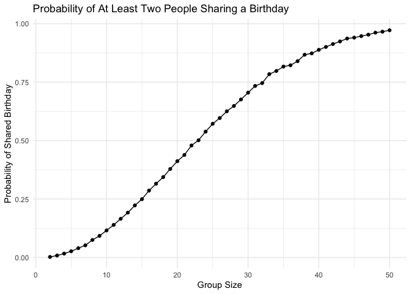
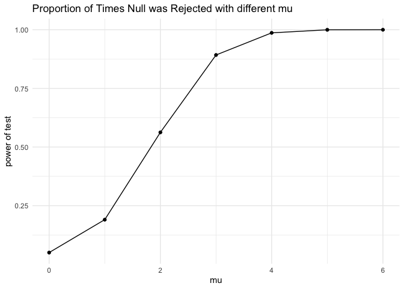
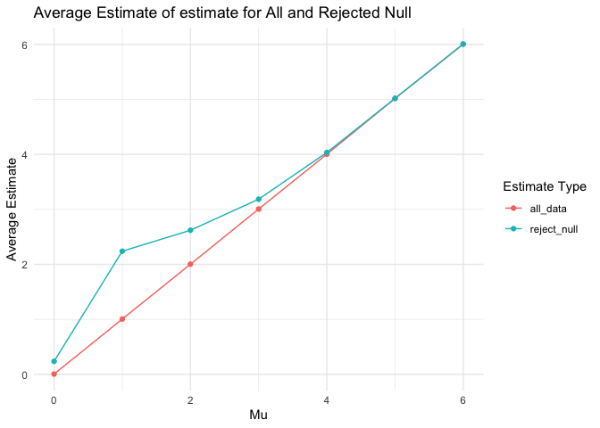
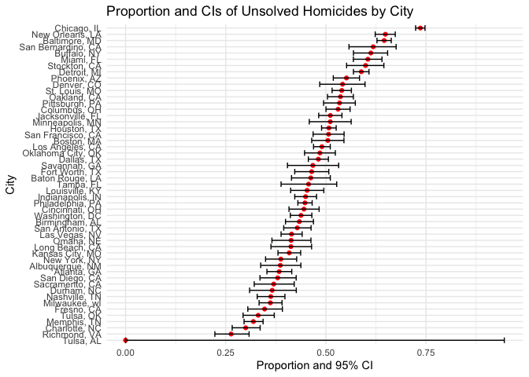

p8105_hw5_xw3038
================
Avery Wang
2024-11-14

``` r
library(tidyverse)
```

    ## ── Attaching core tidyverse packages ──────────────────────── tidyverse 2.0.0 ──
    ## ✔ dplyr     1.1.4     ✔ readr     2.1.5
    ## ✔ forcats   1.0.0     ✔ stringr   1.5.1
    ## ✔ ggplot2   3.5.1     ✔ tibble    3.2.1
    ## ✔ lubridate 1.9.3     ✔ tidyr     1.3.1
    ## ✔ purrr     1.0.2     
    ## ── Conflicts ────────────────────────────────────────── tidyverse_conflicts() ──
    ## ✖ dplyr::filter() masks stats::filter()
    ## ✖ dplyr::lag()    masks stats::lag()
    ## ℹ Use the conflicted package (<http://conflicted.r-lib.org/>) to force all conflicts to become errors

``` r
library(rvest)
```

    ## 
    ## Attaching package: 'rvest'
    ## 
    ## The following object is masked from 'package:readr':
    ## 
    ##     guess_encoding

``` r
library(readr)
library(purrr)
library(tidyr)
library(broom)

set.seed(1)
```

## Problem 1

``` r
#function for finding the duplicate
check_duplicate_birthday=function(n){
  birthdays = sample(1:365, n, replace =TRUE)
  #check if they are duplicated
  if(length(birthdays)==length(unique(birthdays))){
    return(FALSE)
  }else{
    return(TRUE)
  }
  
}
```

``` r
probability_calculation=
  expand_grid(
    #sample size from 2 to 50
    sample_size=2:50,
    iter=1:10000) |>
  mutate(
    #using map function
    duplicate_df=map(sample_size,check_duplicate_birthday)
  )|> 
  #unnest
  unnest(duplicate_df) |>
  group_by(sample_size)|>
  summarize(probability = mean(duplicate_df))
probability_calculation
```

    ## # A tibble: 49 × 2
    ##    sample_size probability
    ##          <int>       <dbl>
    ##  1           2      0.0024
    ##  2           3      0.0085
    ##  3           4      0.0167
    ##  4           5      0.0267
    ##  5           6      0.0399
    ##  6           7      0.0521
    ##  7           8      0.0751
    ##  8           9      0.0925
    ##  9          10      0.116 
    ## 10          11      0.139 
    ## # ℹ 39 more rows

``` r
#plot the probability
probability_calculation|>
  ggplot(aes(x=sample_size,y=probability))+
  geom_line() +
  geom_point() +
  labs(
    x = "Group Size",
    y = "Probability of Shared Birthday",
    title = "Probability of At Least Two People Sharing a Birthday"
  ) +
  theme_minimal()
```

<!-- -->

With the group size getting larger, the probability that at least two
people in the group share the same birthday also increases

# Problem 2

``` r
# make simulation
simulation_ttest=function(mu,n = 30,sigma = 5,alpha=0.05){
  x =rnorm(n, mean = mu, sd = sigma)
  t_test =t.test(x, mu=0)
  tidy_test=broom::tidy(t_test)
  tibble(
      mu_hat = tidy_test$estimate,
      p_value = tidy_test$p.value
    )
}
#for mu is 0
ttest_df_0=expand_grid(dataset=1: 5000,mu=0)|> 
  mutate(
    estimate_df = map_dfr(mu, simulation_ttest)
  ) |> 
  unnest(estimate_df)

# for the other case
ttest_df_others=expand_grid(dataset=1: 5000,mu=1:6)|> 
  mutate(
    estimate_df = map_dfr(mu, simulation_ttest)
  ) |> 
  unnest(estimate_df)
```

``` r
#combine in order to plot
combined_df=bind_rows(ttest_df_0,ttest_df_others)
```

``` r
#proportion of times rejected
combined_df=combined_df |>
  mutate(
    rejection=if_else(p_value<0.05,TRUE,FALSE)
  )

#group by mu and then plot
combined_df|> group_by(mu)|>
  summarize(proportion_rejection=mean(rejection)) |>
  ggplot(aes(x=mu,y=proportion_rejection))+
  geom_line() +
  geom_point() +
  labs(
    x = "mu",
    y = "power of test",
    title = "Proportion of Times Null was Rejected with different mu"
  ) +
  theme_minimal()
```

<!-- -->

``` r
combined_df|> group_by(mu)|>
  summarize(
    all_data= mean(mu_hat),
    reject_null = mean(mu_hat[p_value < 0.05])
  )|>
  pivot_longer(
    cols = c(all_data, reject_null),
    names_to = "estimate_type",
    values_to = "estimate"
  ) |>
  ggplot(aes(x = mu, y = estimate, color = estimate_type)) +
  geom_line() +
  geom_point() +
  labs(
    x = "Mu",
    y = "Average Estimate",
    title = "Average Estimate of estimate for All and Rejected Null",
    color = "Estimate Type"
  ) +
  theme_minimal()
```

<!-- -->

the sample average of $\hat{\mu}$ for which the null hypothesis was
rejected is not approximately equal to the true value of $\mu$. The
possible reason is that samples with higher average estimate are more
likely to have statistically significant results, and thus more likely
to reject the null hypothesis.

## Problem 3

``` r
homicide=read_csv(file = "./homicide-data.csv", na = c(".", "NA", "")) |>
  janitor::clean_names() 
```

    ## Rows: 52179 Columns: 12
    ## ── Column specification ────────────────────────────────────────────────────────
    ## Delimiter: ","
    ## chr (9): uid, victim_last, victim_first, victim_race, victim_age, victim_sex...
    ## dbl (3): reported_date, lat, lon
    ## 
    ## ℹ Use `spec()` to retrieve the full column specification for this data.
    ## ℹ Specify the column types or set `show_col_types = FALSE` to quiet this message.

The raw dataset has 12 columns and 52179 rows. And the dataset include
variables: uid, reported_date, victim_last, victim_first, victim_race,
victim_age, victim_sex, city, state, lat, lon, disposition that
describes the information about the homicide cases such as the victim
information, location of the homicide events, date being reported, and
the disposition of the homicide case.

- summarize within cities to obtain the total number of homicides and
  the number of unsolved homicides (those for which the disposition is
  “Closed without arrest” or “Open/No arrest”).

``` r
#Create a city_state
homicide_data=homicide|> 
  mutate(city_state = paste(city, state, sep = ", "))|>
  distinct()
homicide_data|>
  group_by(city)|>
  #find the total homicide 
  summarize(total_homicides = n(),
            # find the homocides that are unsolved
            unsolved_homicides=sum(disposition %in% c("Closed without arrest", "Open/No arrest")))
```

    ## # A tibble: 50 × 3
    ##    city        total_homicides unsolved_homicides
    ##    <chr>                 <int>              <int>
    ##  1 Albuquerque             378                146
    ##  2 Atlanta                 973                373
    ##  3 Baltimore              2827               1825
    ##  4 Baton Rouge             424                196
    ##  5 Birmingham              800                347
    ##  6 Boston                  614                310
    ##  7 Buffalo                 521                319
    ##  8 Charlotte               687                206
    ##  9 Chicago                5535               4073
    ## 10 Cincinnati              694                309
    ## # ℹ 40 more rows

- Estimate the proportion of homicides that are unsolved for Baltimore,
  MD

``` r
#filter out Baltimore
baltimore_data =homicide_data|>filter(city_state=="Baltimore, MD")
total_bal=nrow(baltimore_data)
unsolved_bal=sum(baltimore_data$disposition %in% c("Closed without arrest", "Open/No arrest"))
# Perform the proportion test
prop_test_result=prop.test(unsolved_bal, total_bal)
tidy_result=broom::tidy(prop_test_result)

estimated_proportion=tidy_result|>pull(estimate)
conf_low=tidy_result|>pull(conf.low)
conf_high=tidy_result|>pull(conf.high)
```

So the estimated proportion is 0.65 and the 95% percent CI falls in
\[0.63, 0.66\].

- Extract both the proportion of unsolved homicides and the confidence
  interval for each

``` r
#make summary on the homocide data for total and unsolved
homicide_summary_city =homicide_data |>
  group_by(city_state) |>
  summarize(
    total_homicides = n(),
    unsolved_homicides=sum(disposition %in% c("Closed without arrest", "Open/No arrest")),
  )

#figure out the proportion and CI
cities_proportion=homicide_summary_city |>
  mutate(
    proportion_cities= map2(
      unsolved_homicides, total_homicides,
      ~ prop.test(.x,.y) |>broom::tidy()
    )
  )|>unnest(proportion_cities)|> 
  select(city_state,total_homicides, unsolved_homicides,estimate, conf.low,conf.high)
```

    ## Warning: There was 1 warning in `mutate()`.
    ## ℹ In argument: `proportion_cities = map2(...)`.
    ## Caused by warning in `prop.test()`:
    ## ! Chi-squared approximation may be incorrect

``` r
cities_proportion
```

    ## # A tibble: 51 × 6
    ##    city_state     total_homicides unsolved_homicides estimate conf.low conf.high
    ##    <chr>                    <int>              <int>    <dbl>    <dbl>     <dbl>
    ##  1 Albuquerque, …             378                146    0.386    0.337     0.438
    ##  2 Atlanta, GA                973                373    0.383    0.353     0.415
    ##  3 Baltimore, MD             2827               1825    0.646    0.628     0.663
    ##  4 Baton Rouge, …             424                196    0.462    0.414     0.511
    ##  5 Birmingham, AL             800                347    0.434    0.399     0.469
    ##  6 Boston, MA                 614                310    0.505    0.465     0.545
    ##  7 Buffalo, NY                521                319    0.612    0.569     0.654
    ##  8 Charlotte, NC              687                206    0.300    0.266     0.336
    ##  9 Chicago, IL               5535               4073    0.736    0.724     0.747
    ## 10 Cincinnati, OH             694                309    0.445    0.408     0.483
    ## # ℹ 41 more rows

- Create a plot that shows the estimates and CIs for each city

``` r
cities_proportion|>
  ggplot(aes(x = reorder(city_state, estimate), y = estimate))+
  geom_point(color="red",stat="identity")+
  geom_errorbar(aes(ymin = conf.low, ymax = conf.high))+
  coord_flip() +
  labs(
    title = "Proportion and CIs of Unsolved Homicides by City",
    x = "City",
    y = "Proportion and 95% CI"
  ) +theme_minimal() 
```

<!-- -->
